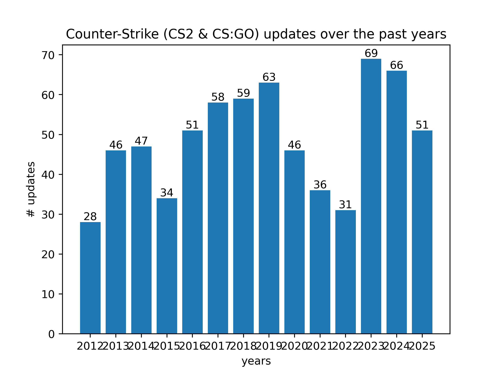
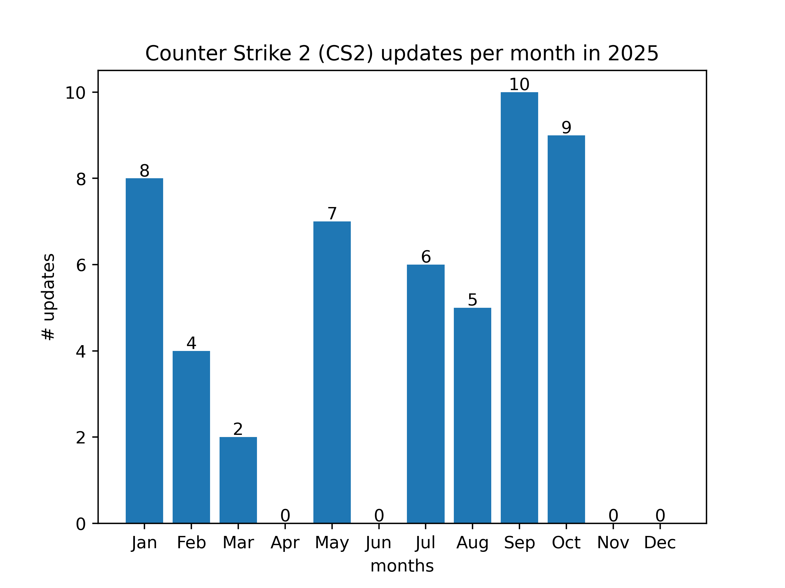

# Counter-Strike Updates as JSON
## About
This repository acts as crawler of Counter-Strike: Global Offensive and the new announced Counter-Strike 2 updates. It contains all **announced** Counter-Strike: Global Offensive (2012 - 202x) and Counter-Strike 2 updates (Test version 2023). The data is put together in a `.json` file per game. These files can then be used for data operations and visualizations.

* Counterstrike CS:GO & CS2 updates taken from
    * https://www.counter-strike.net/news/updates
* CS:GO
    * https://blog.counter-strike.net/index.php/category/updates/ (outdated 2023-02-15)
    * [https://store.steampowered.com/oldnews/](https://store.steampowered.com/oldnews/?appids=730&appgroupname=Counter-Strike:+Global+Offensive&feed=steam_updates) (outdated 2013-12-12)


## Setup
Create a Python (vers. 3.10) virtual environment and install dependencies in order to run the crawler if required. Only the web crawler uses non default Python modules like `Beautifulsoup` and `requests`. Operations on the data can be done without any 3rd party package.

`pip install -r requirements.txt`

## Data
The collected **raw** data can be found in the `data` folder. The folder is split into `csgo` and `cs2`.
* Raw file (latest) since announcement of Counter-Strike 2 can be found in `data/cs2/updates_raw.json`
    * Pulls the raw events based on a simple `get` request on the Valve website
    * The data combines the latest Counter-Strike updates which includes CS:GO updates
* (Deprecated) Raw file CS:GO `data/csgo/updates_combined_raw.json`
    * This file is a combination of `updates_new.json` and `updates_old.json` since updates were posted on two different web pages

### CS:GO & CS2
The data is pulled from [CS2 & CS:GO Data](https://www.counter-strike.net/news/updates). The data is untouched and keys are taken over from the pulled data.

### CS:GO Data (Deprecated 2023-02-15)
The data content looks like the following for every update entry:
```
{
    "id": "<post_id>",
    "timestamp": "16 Aug 2012",
    "link": "<link_to_post>",
    "entry" "<update_content_string>"
}
```
For the old updates which are stored here: [Steam CS:GO Updates](https://store.steampowered.com/oldnews/?appids=730&appgroupname=Counter-Strike%3A+Global+Offensive&feed=steam_updates) the `id` field is based on the post ID crawled from the HTML div content. For all newer updates from [Counter-Strike.net](https://blog.counter-strike.net/index.php/category/updates/) we just hashed the date string and used that one as `id` since no HTML div id could be found.

In order to do some additional data analysis we introduced **custom tags**. See `data/csgo/updates_combined_custom.json` (The list might grow in future).

```
{
    (...) // same content as above
    "tags": "<tags_identifing_the_update>",
    "chars": "<integer_character_length_of_update_content>"
}
```
`tags` have been added manually based on the update content.

## Github Actions
A Github Action is enabled pulling the data twice a day to check whether an update has been released.

[](https://github.com/ckreisl/cs-updates-as-json/actions/workflows/poll-cs-updates.yml)

## Examples


